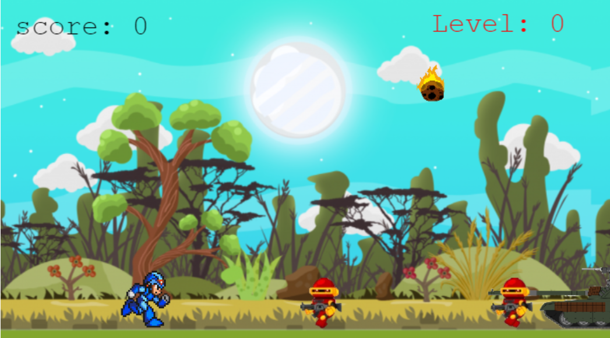
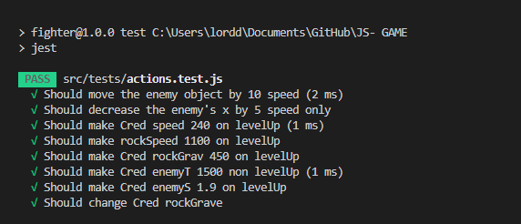

# Andal Fighters

This is a javascript video game made using Phaser 3. A simple and fantastic game where you can fight soldiers, enemies and avoid falling rocks!!


## Live Demo

[PLAY!](https://lucid-joliot-e8cdf9.netlify.app/)

<br>



## Game instructions:

- Enter your name and click start button.
- You can move left, right and jump using keyboard <' arrows '>.
- You can fire and kill enemies using keyboard <' space '>.
- You level up when your score advances.
- When you level up your speed increases and the game gets harder!


## Usage

- Clone the repo  ```git clone https://github.com/Mohamed-js/JS--GAME.git```.
- cd into the game directory.
- Run  ```npm install```.
- Open in a browser.

## Tests

Inside the game directory:
- Run  ```npm install``` to install project dependencies.
- Run ```npm run test ``` to run the unit tests locally.


## Technologies

- Jest
- JavaScript
- CSS
- Webpack
- Phaser 3
- Leaderboard API
- npm
- VSCode

## Author

👤 **Mohammed Atef**

- GitHub: [@Mohamed-Atef](https://github.com/Mohamed-js)
- Twitter: [@Mohammed_Atef](https://twitter.com/Demovejetta)
- LinkedIn: [LinkedIn](https://www.linkedin.com/in/mohamed-js/)

<!-- Design -->
## Design Process

> The goal was to create a platform game in which the main character i.e the player can move around and shoot at the other characters in the game i.e the enemies.

#### Story and game play
The idea that came to my head was to create a fighter game and it wasn't that difficult coming up with the game play since I have played such games when I was young. So the story line behind the game is that robots are tring to kill the hero and in order to prevent that from happening, that player has to shoot down all the enemies. 

#### Assets choice
I picked the assets from different sites on googling, and these includes the player sprite, the enemy robot, the enemy tank, the player boom, the rocks, the background and the background music.

#### Before starting
It took me some time to understand Phaser to the point where I could build something with it. The documentation helped a lot as well as the numerious youtube videos and articles about phaser.

#### Development stage

> I started by creating the different scenes in my game following the documentation. This gives me some level of confidence because within the first hours, I already have a deliverable.

> After that, I picked the scenes one after the other and I preloaded the required assets. I also link the scenes all together according to the game design, so I can move freely from one scene to another.

> Next, I focused on the play scene, as this is the most complicated one. I added helper methods to actions.js. I also added logics to animate player, enemy robot and to make their movement. Having done these, I added logic to move the player around and to make the player shoot.

> I later added logics to monitor collision between the player, enemy, player powers and ground. Lastly in the game scene, I added the score mechanism to keep track of each game session's scores.

> A player do have to enter his name before playing the game. If a player did not enter his/her name, the game will not begin.

<!-- End -->

## 🤝 Contributing

Contributions, issues, and feature requests are welcome!


## Show your support

Give a ⭐️ if you like this project!

### Acknowledgements

- Microverse
- Notion
- Phaser
- Leaderboard API
- Pexel

## 📝 License

This project is [MIT](LICENSE) licensed.
